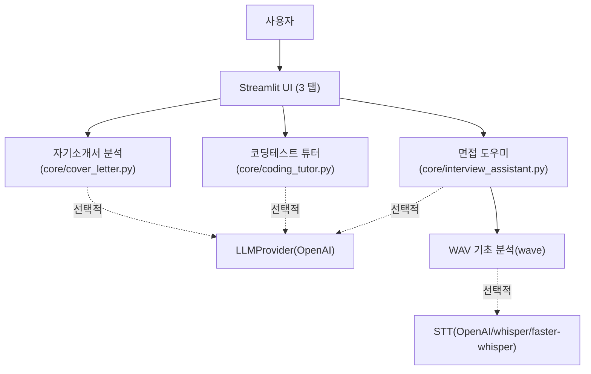

# 취업 준비 튜터 (Job Prep Tutor)

## 1. 프로젝트 요약 소개
로컬에서 실행되는 Streamlit 기반의 에이전트형 도우미 앱입니다. 취업 준비 과정의 세 핵심 영역을 한 곳에서 지원합니다.
- 자기소개서 첨삭 및 피드백
- 코딩테스트 튜터(정적 분석, 샘플 테스트 실행, 힌트)
- 면접 도우미(텍스트 스크립트 분석, 오디오 길이/발화 속도, 선택적 STT 전사)

기본적으로 규칙 기반으로 작동하며 인터넷 없이도 사용 가능합니다. 환경 변수 `OPENAI_API_KEY`가 설정되면 LLM 기반의 심화 피드백을 추가 제공합니다.

## 2. 프로젝트의 목적
- 취업 준비의 반복 작업(자소서 첨삭, 코드 디버깅, 면접 대비)을 빠르고 일관되게 수행
- 로컬 우선 설계로 개인정보(자소서, 면접 스크립트, 코드)가 외부로 유출되지 않도록 기본 보안 확보
- LLM/STT가 가능하면 플러그인처럼 끼워 넣어 품질 향상, 없으면 규칙 기반으로도 충분히 활용 가능

## 3. 자세한 사용 방법
### 3.1 설치 (Windows)
1) Python 3.9+ 권장 (3.10~3.12 호환)

2) 가상환경(선택)
```powershell
python -m venv .venv
.\.venv\Scripts\Activate.ps1
```

3) 의존성 설치
```powershell
python -m pip install --upgrade pip
pip install -r job_tutor/requirements.txt
```

### 3.2 실행
```powershell
streamlit run job_tutor/app.py
```
브라우저가 자동으로 열리지 않으면 콘솔에 표시된 `http://localhost:8501` 등의 URL을 복사해 접속하세요.

### 3.3 선택적 LLM 사용
- OpenAI API 키가 있다면 다음 중 하나로 설정합니다.
```powershell
$env:OPENAI_API_KEY = "sk-..."
```
- 사이드바 입력란에도 키를 넣을 수 있습니다(세션 한정).
- 키가 없으면 규칙 기반 피드백만 동작합니다.

### 3.4 오디오(STT) 옵션
- `.wav` 업로드 시 길이, 샘플레이트, 채널, 대략적인 분당 문자수 지표를 제공합니다.
- 음성 → 텍스트 전사를 원하면 아래 중 하나를 설치하면 앱이 자동 인식하여 사용합니다(선택):
  - `openai`(이미 포함) + `OPENAI_API_KEY` → OpenAI STT
  - `openai-whisper` → 로컬 Whisper
  - `faster-whisper` → 로컬 고속 Whisper

설치하지 않아도 앱은 정상 실행되며 텍스트 스크립트 분석은 그대로 동작합니다.

### 3.5 탭별 사용법
- 자기소개서 첨삭
  - 문항+답변을 붙여넣거나 `.txt` 업로드 → [첨삭 실행]
  - 규칙 기반: 문장 길이, 가독성, 수동태, 일반 미사여구, 수치화 여부, STAR(S/T/A/R) 커버리지
  - LLM 사용 시: 핵심 요약, 강점, 개선점, 200자 내외 샘플 리라이팅 제공

- 코딩테스트 튜터
  - 문제 설명 입력 → 코드(Python) 붙여넣기 → (옵션) 샘플 테스트케이스 입력 → [테스트 실행]
  - 샘플 테스트케이스 형식:
    ```
    INPUT:
    3 4
    1 2 3 4
    EXPECTED:
    10
    ---
    INPUT:
    5
    6
    EXPECTED:
    11
    ```
  - 규칙 기반: AST 정적 분석, 복잡도 추정, 흔한 예외 힌트, 타임아웃(기본 2초)
  - LLM 힌트: 실패 가능 지점, 테스트 설계 힌트, 복잡도 개선 아이디어, (선택) 레퍼런스 정답 코드
  - 실행 주의: 업로드된 코드는 로컬에서 별도 프로세스로 실행됩니다. 신뢰 가능한 코드만 실행하세요.

- 면접 도우미
  - 텍스트 스크립트 붙여넣기 → [분석 실행]
  - 규칙 기반: STAR 커버리지, 강점/개선점, 꼬리질문 3개
  - 오디오 업로드: 길이/속도 지표 제공, STT 사용 시 전사 텍스트 기반 분석 추가
  - LLM 사용 시: 면접관 스타일의 꼬리질문/피드백 강화

## 4. 사용된 기술 스택과 선정 근거
- Streamlit: 빠른 MVP 구현과 UI 구성 용이성
- Python 표준 라이브러리
  - `ast`: 파이썬 코드 정적 분석과 패턴 탐지에 적합
  - `subprocess`, `tempfile`: 별도 프로세스 실행 및 타임아웃으로 안전성 확보(윈도우 호환)
  - `wave`, `contextlib`, `os`: 추가 의존성 없이 오디오 기초 지표 산출
- OpenAI Python SDK(선택): 한글 피드백 품질, 간결한 API, 안정적 최신 모델 접근성
- Whisper / Faster-Whisper(선택): 로컬 STT 대안 제공 → 네트워크 제약 환경에서도 사용 가능

선정 근거 요약: 로컬 우선, 가볍고 빠른 구현, 선택적으로 고품질 모델을 결합할 수 있는 유연성.

## 5. 간단한 구성도


## 6. 자주 나오는 질문
- 실행이 안 돼요 / 빈 화면이에요
  - 반드시 `streamlit run job_tutor/app.py`로 실행하세요. `python job_tutor/app.py`는 지원하지 않습니다.
- 인터넷이 없어도 되나요?
  - 됩니다. 기본 규칙 기반 기능은 오프라인으로 동작합니다. LLM/STT 기능만 네트워크 또는 추가 패키지에 의존합니다.
- OpenAI 키가 없는데도 쓸 수 있나요?
  - 가능합니다. 키가 없으면 LLM 피드백이 비활성화되고 규칙 기반 피드백만 제공됩니다.
- 오디오는 어떤 형식이 필요한가요?
  - `.wav`를 권장합니다. 다른 포맷은 지원하지 않습니다(간단한 표준 라이브러리 사용).
- STT 전사가 실패해요
  - OpenAI 키를 설정하거나 `pip install openai-whisper` 또는 `pip install faster-whisper` 설치 후 다시 시도해 보세요.
- 코드 실행이 위험하지 않나요?
  - 업로드 코드는 사용자 로컬에서 별도 프로세스로만 실행하며, 시간 제한이 있습니다. 그래도 신뢰 가능한 코드만 실행하세요.
- 권장 파이썬 버전은?
  - 3.9 이상(3.10~3.12 권장). 최신 pip/의존성이 설치돼야 합니다.

## 7. 레퍼런스
- Streamlit Docs: [https://docs.streamlit.io](https://docs.streamlit.io)
- OpenAI Python SDK: [https://github.com/openai/openai-python](https://github.com/openai/openai-python)
- Whisper: [https://github.com/openai/whisper](https://github.com/openai/whisper)
- Faster-Whisper: [https://github.com/SYSTRAN/faster-whisper](https://github.com/SYSTRAN/faster-whisper)
- Python `ast` 모듈: [https://docs.python.org/3/library/ast.html](https://docs.python.org/3/library/ast.html)
- Python `subprocess` 모듈: [https://docs.python.org/3/library/subprocess.html](https://docs.python.org/3/library/subprocess.html)

---

## 부록) 빠른 시작 요약
- 설치: `pip install -r job_tutor/requirements.txt`
- 실행: `streamlit run job_tutor/app.py`
- (선택) LLM: `$env:OPENAI_API_KEY = "sk-..."`
- (선택) STT: `pip install openai-whisper` 또는 `pip install faster-whisper` 